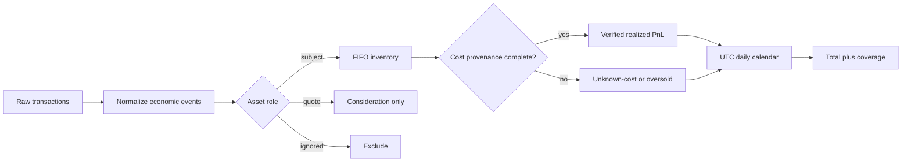

<div align="center">

# Wallet PnL Lab

### A transparent reference model for wallet-level realized PnL without invented cost basis.

   

</div>

Wallet PnL is easy to display and surprisingly hard to calculate. A transfer can look like a free acquisition, wrapped native assets can be counted as profitable tokens, a swap can appear as several unrelated transfers, and an incomplete index can turn missing history into imaginary gains.

This repository is an executable methodology for the part that can be defended: realized PnL from normalized trades with known inventory provenance. It is a public engineering reference, not production PNLFlex source code.

## What it prevents

| Failure mode | Naive result | Lab behavior |
| --- | --- | --- |
| Incoming token transfer | Cost basis becomes `$0` | Exit remains `unknown-cost` |
| Sale before indexed buys | Entire proceeds become profit | Exit becomes `oversold` |
| WETH/native/stable legs | Separate token PnL | Assets act as quote currency |
| DEX router transfer fan-out | Multiple fake trades | Input contract expects one economic trade |
| Missing history | Confident but wrong total | Coverage falls below 100% |
| Fees | Ignored or counted twice | Buy fee enters basis; sell fee reduces proceeds |
| Local timezone | Trade moves between days | Calendar uses UTC explicitly |

## Calculation boundary



The lab deliberately starts after chain-specific transaction decoding. A production decoder should collapse router calls, transfers, fees, and internal operations into the `LedgerEvent` contract before calculation.

## Methodology

For a verified sale:

```text
buy unit cost = (gross buy consideration + buy fee) / acquired quantity
net sale proceeds = gross sale consideration - sell fee
realized PnL = net sale proceeds - FIFO cost of sold quantity
```

The engine never substitutes zero for missing cost. If any portion of an exit consumes unknown inventory, the exit has no reported PnL. This is intentionally conservative: partial mathematical output can look more precise while being less truthful.

### Three numbers, three meanings

- **Verified realized PnL**: closed inventory with complete indexed cost.
- **Coverage**: sold quantity whose basis was fully classified divided by all sold quantity.
- **Portfolio move**: not calculated here; it requires historical balances and mark prices and must not be presented as realized trading PnL.

## Data contract

```ts
type LedgerEvent = TradeEvent | TransferEvent;

interface TradeEvent {
  kind: "trade";
  subject: Asset;
  side: "buy" | "sell";
  quantity: number;
  grossUsd: number;
  feeUsd: number;
}
```

The full typed contract is in [`src/model.ts`](src/model.ts). Asset roles are explicit rather than inferred from ticker text, so native, wrapped-native, stablecoin, LP, and protocol-specific assets can be classified by chain-aware configuration upstream.

## FIFO with provenance

The core behavior lives in [`src/engine.ts`](src/engine.ts):

```ts
if (lot.unitCostUsd === null) unknown += used;
else cost += used * lot.unitCostUsd;
```

That small branch is the important product decision. Unknown basis propagates to the result instead of silently becoming profit.

Example output:

```json
{
  "verifiedPnlUsd": 156.2,
  "coverage": {
    "classifiedQuantity": 400,
    "soldQuantity": 400,
    "ratio": 1
  },
  "calendar": [
    {
      "date": "2026-09-03",
      "verifiedPnlUsd": 156.2,
      "exitCount": 1,
      "classifiedExitCount": 1
    }
  ]
}
```

## Calendar semantics

The calendar is an aggregation view, not a second PnL algorithm. Each cell is derived only from classified exits whose timestamp falls on that UTC date. A trading day with only unknown-cost exits stays visible through its exit count but contributes no fabricated dollar result.

This separation makes the UI explainable: selecting a day can reveal the exact exits, cost lots, fees, and classification behind the number.

## Run it

```bash
npm install
npm run check
npm test
npm run demo
```

The demo uses a normalized buy and sale plus a WETH quote leg. The test suite covers FIFO lot matching, fees, transfer provenance, oversold inventory, quote-asset exclusion, UTC boundaries, event ordering, and duplicate protection.

## Production extensions

This reference intentionally omits chain-specific indexers and private product logic. A production implementation would add:

1. transaction decoding and economic swap grouping;
2. chain-specific asset-role registries;
3. bridge and cross-wallet provenance reconciliation;
4. historical USD valuation with source and timestamp evidence;
5. corporate actions such as rebases, migrations, and LP positions;
6. deterministic decimal arithmetic instead of JavaScript numbers;
7. event-level audit views and index coverage windows.

## Product and UI rationale

- Label the metric **realized PnL**, never just “profit”.
- Display coverage beside the total, because confidence is part of the result.
- Keep unknown exits inspectable instead of hiding them from the calendar.
- Separate realized PnL, portfolio move, and unrealized value into distinct views.
- Show the timezone and valuation source where users make comparisons.
- Prefer `N/A` over a number that cannot be reconstructed.

## Scope

The project demonstrates accounting boundaries and implementation choices. It is not tax advice, a complete portfolio accountant, or a claim that FIFO is the only valid accounting method. Jurisdictional reporting can require a different method.

## Author

Built by [0xENTYPER](https://github.com/0xENTYPER).
